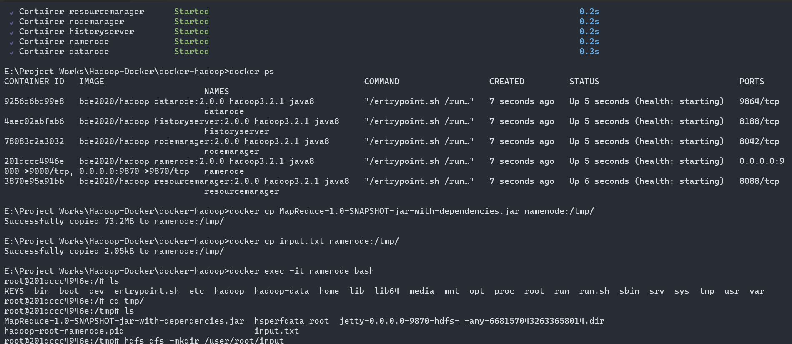
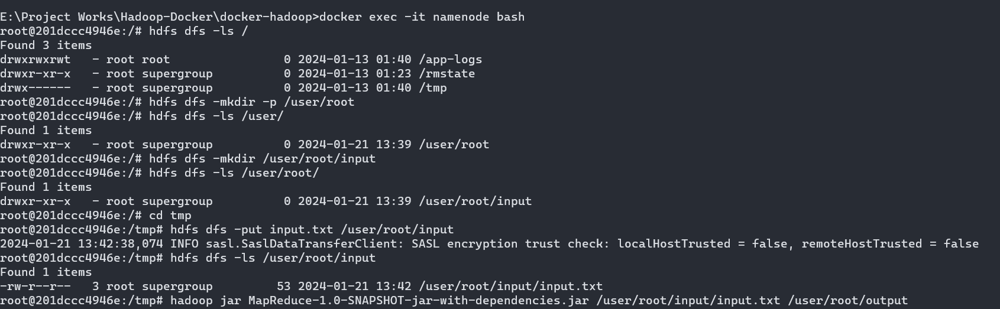
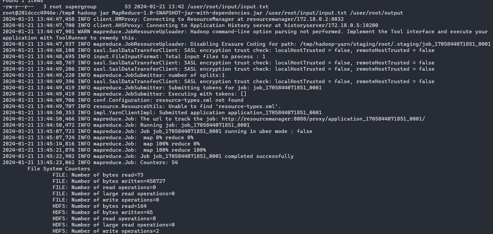
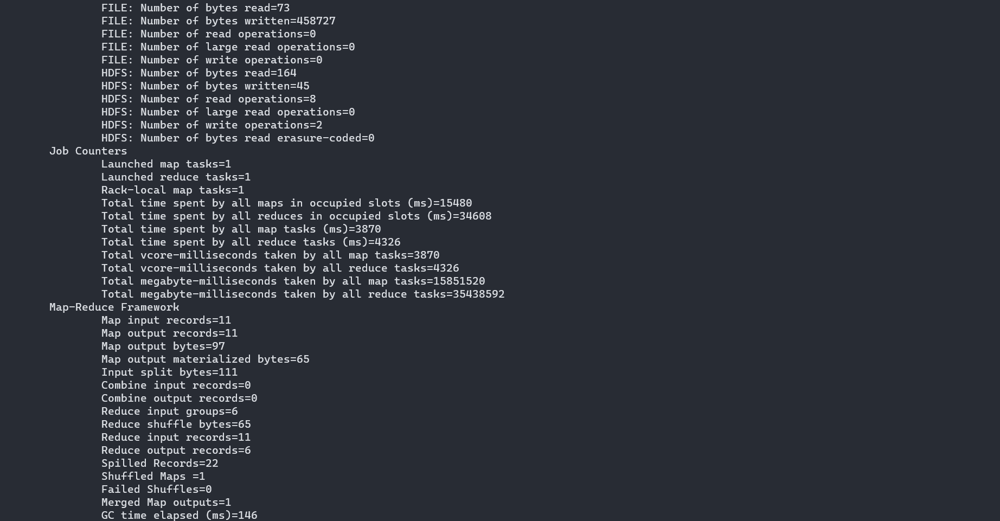
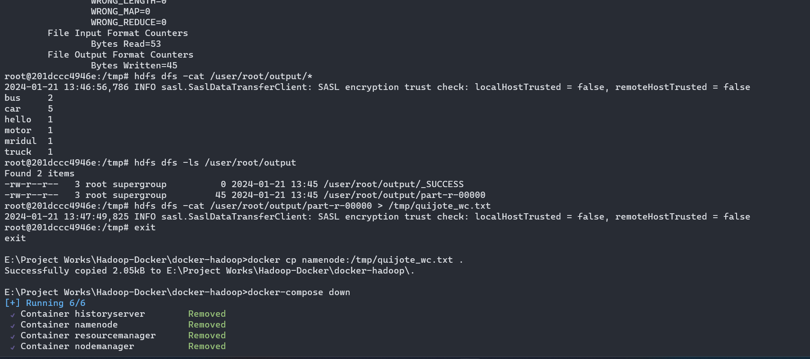

- Open CMD where you clonned "Big Data Europe" Folder
```
docker-compose up -d
```
```
docker ps
```

- Copy the jar file from in Your Java Project Word Count to "Big Data Europe" Folder
- Copy the Input file from in Your Java Project Word Count to "Big Data Europe" Folder
```
docker cp MapReduce-1.0-SNAPSHOT-jar-with-dependencies.jar namenode:/tmp/
```
```
docker cp input.txt namenode:/tmp/
```

- Check Docker successfully received the Files
```
- docker exec -it namenode bash
- ls
- cd tmp/
- ls
- exit
```


- Create Some Folder and Copy Files
```
docker exec -it namenode bash
```

```
hdfs dfs -ls /
hdfs dfs -mkdir -p /user/root
hdfs dfs -ls /user/root/
```

```
hdfs dfs -mkdir /user/root/input
hdfs dfs -ls /user/root/
```

```
cd tmp
hdfs dfs -put input.txt /user/root/input
hdfs dfs -ls /user/root/input
```



- Now Run Hadoop with following command
```
 hadoop jar MapReduce-1.0-SNAPSHOT-jar-with-dependencies.jar /user/root/input/input.txt /user/root/output
```



- Now Check Output
```
hdfs dfs -cat /user/root/output/*
```


- Save the output to Root Directory
```
hdfs dfs -ls /user/root/output

hdfs dfs -cat /user/root/output/part-r-00000 > /tmp/output.txt

exit

docker cp namenode:/tmp/output.txt .
```

- Turn down the containers using:
```
docker-compose down
```

